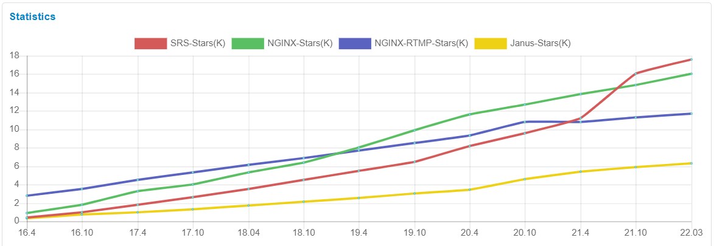
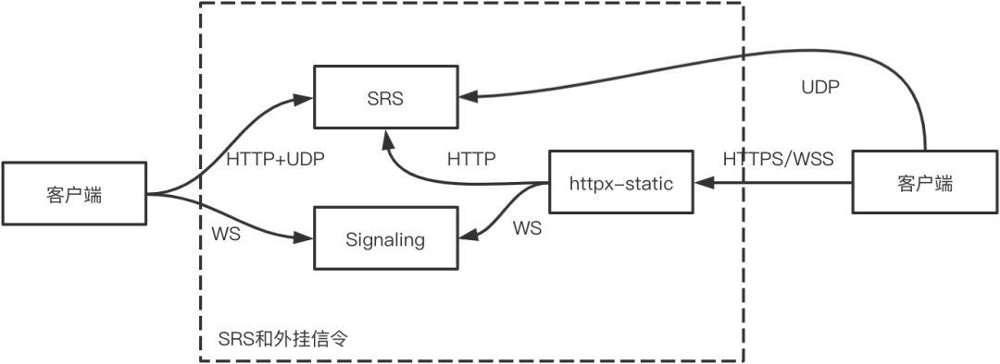
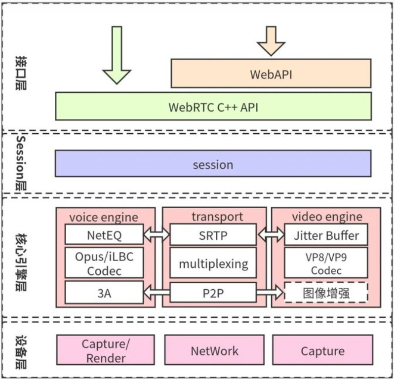
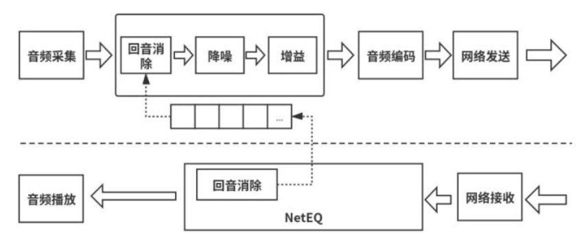

# SRSv4媒体服务器PoC

SRS是一个高效的开源实时视频服务器，支持RTMP/WebRTC/HLS/HTTP-FLV/SRT/GB28181等多种协议。

近年来，SRS社区随着视频直播的发展，目前已经超过一些老牌项目成为关注度Top1的高性能媒体服务器框架，由国人主导开发，核心开发者来自多家一线互联网公司的媒体服务业务团队。



(图为SRS在今年来star数的增长趋势)

## 从源码编译可执行文件

```bash
git clone -b 4.0release https://gitee.com/ossrs/srs.git
```

进行编译，注意需要切换到srs/trunk目录：

```bash
cd srs/trunk
./configure
make
```

启动服务器：

```bash
./objs/srs -c conf/srs.conf
```

检查SRS是否成功启动，可以打开 http://localhost:8080/ ，或者执行命令：

```bash
# 查看SRS的状态
./etc/init.d/srs status

# 或者看SRS的日志
tail -n 30 -f ./objs/srs.log
```

使用 FFmpeg或OBS推流：

```bash
ffmpeg -re -i ./doc/source.flv -c copy -f flv rtmp://localhost/live/livestream
```

## 服务部署

## 安装docker

```bash
sudo apt-get remove docker docker-engine docker.io containerd runc
sudo apt-get update
sudo apt-get install \
    ca-certificates \
    curl \
    gnupg \
    lsb-release
sudo mkdir -p /etc/apt/keyrings
curl -fsSL https://download.docker.com/linux/ubuntu/gpg | sudo gpg --dearmor -o /etc/apt/keyrings/docker.gpg
echo \
  "deb [arch=$(dpkg --print-architecture) signed-by=/etc/apt/keyrings/docker.gpg] https://download.docker.com/linux/ubuntu \
  $(lsb_release -cs) stable" | sudo tee /etc/apt/sources.list.d/docker.list > /dev/null
sudo apt-get update
sudo apt-get install docker-ce docker-ce-cli containerd.io docker-compose-plugin
```

### 配置镜像和配置文件

拉取国内的加速镜像：

```bash
docker pull registry.cn-hangzhou.aliyuncs.com/ossrs/srs:4
docker pull registry.cn-hangzhou.aliyuncs.com/ossrs/signaling:1
docker pull registry.cn-hangzhou.aliyuncs.com/ossrs/httpx:v1.0.2
```

编写SRS配置文件：

```conf
listen              1935;
max_connections     1000;
daemon              off;
srs_log_tank        console;

http_server {
    enabled         on;
    listen          8080;
    dir             ./objs/nginx/html;
}

http_api {
    enabled         on;
    listen          1985;
}
stats {
    network         0;
}
rtc_server {
    enabled on;
    listen 8000; # UDP port
    # @see https://github.com/ossrs/srs/wiki/v4_CN_WebRTC#config-candidate
    candidate $CANDIDATE;
}

vhost __defaultVhost__ {
    rtc {
        enabled     on;
        # @see https://github.com/ossrs/srs/wiki/v4_CN_WebRTC#rtmp-to-rtc
        rtmp_to_rtc off;
        # @see https://github.com/ossrs/srs/wiki/v4_CN_WebRTC#rtc-to-rtmp
        rtc_to_rtmp off;
    }
    http_remux {
        enabled     on;
        mount       [vhost]/[app]/[stream].flv;
    }
}

```

### 关于Candidate

candidate就是服务器的候选地址，客户端可以连接的地址ip:port，在SDP交换中， 就有个candidate的信息，比如服务器回的answer可能是这样：

```bash
type: answer, sdp: v=0
a=candidate:0 1 udp 2130706431 192.168.3.6 8000 typ host generation 0
```

上面SDP中的192.168.3.6 8000，就是candidate listen这两个配置，即服务器的IP和端口。

简单来说，如果在SRS运行的服务器上，运行ifconfig获取的IP地址，是客户端访问不了的地址， 就必须通过配置candidate，指定一个客户端能访问的地址。通过ifconfig获取本机IP：

```bash
# For macOS
CANDIDATE=$(ifconfig en0 inet| grep 'inet '|awk '{print $2}')

# For CentOS
CANDIDATE=$(ifconfig eth0|grep 'inet '|awk '{print $2}')

# Directly set ip.
CANDIDATE="121.37.103.111"
```

### 容器化启动媒体服务

使用单台服务器作为信令和媒体服务

```bash
export CANDIDATE="121.37.103.111"
ssh root@$CANDIDATE
```

在服务器中执行，设定自身为CANDIDATE

```bash
export CANDIDATE="121.37.103.111"
```

用Docker方式运行SRS，设置环境变量的方法：运行容器服务

```bash
docker run --rm --env CANDIDATE=$CANDIDATE \
  -p 1935:1935 -p 8080:8080 -p 1985:1985 -p 8000:8000/udp \
  registry.cn-hangzhou.aliyuncs.com/ossrs/srs:4 \
  objs/srs -c conf/rtc.conf
```

### 信令服务器

信令是实现音视频通信的重要一环，比如创建房间、离开房间、交换双端offer/answer以及candidate信息等。但WebRTC规范文档中并未定义信令相关的内容.

因为不同业务，逻辑不同，信令也会千差万别，所以需要各个业务自己实现一套信令服务。

SRS自带了一个golang版本的信令服务器，可以在本地运行，也可以在远程服务器上运行。

```bash
docker run --rm -p 1989:1989 registry.cn-hangzhou.aliyuncs.com/ossrs/signaling:1
```

### 代理网关服务器

由于客户端与服务器之间的通信，有部分接口基于TCP，所以需要一个代理网关服务器来转发信令和媒体数据。

SRS自带了一个golang版本的代理网关服务器，启动httpx-static，转换HTTPS和WSS协议：

```bash
docker run --rm -p 80:80 -p 443:443 registry.cn-hangzhou.aliyuncs.com/ossrs/httpx:v1.0.2 \
    ./bin/httpx-static -http 80 -https 443 -ssk ./etc/server.key -ssc ./etc/server.crt \
          -proxy http://$CANDIDATE:1989/sig -proxy http://$CANDIDATE:1985/rtc \
          -proxy http://$CANDIDATE:8080/
```

部署后的服务拓扑如下：



如果是本机(localhost)访问，那可以走左边链路，用HTTP和WS访问。

如果是非本机访问，比如局域网访问，或者部署在公网，则必须走右边链路，额外部署一个httpx-static，支持HTTPS和WSS。

### WebRTC Demo测试

#### 一对一通话：

本机(localhost)可以直接打开 http://localhost/demos/one2one.html?autostart=true

若非本机，则可以打开 https://121.37.103.111/demos/one2one.html?autostart=true。

#### 房间多人通话：

本机(localhost)可以直接打开 http://localhost/demos/room.html?autostart=true。

若非本机，则可以打开 https://121.37.103.111/demos/room.html?autostart=true。

### RTC to RTMP

WebRTC推流，可以转成RTMP流播放，SRS只会对音频转码（Opus转AAC），因此要求视频是H.264编码。

相关的配置说明：

- rtc.rtc_to_rtmp：是否开启RTC转RTMP，只会对音频转码（Opus转AAC），视频（H.264）不转码，默认off。
- rtc.pli_for_rtmp：请求关键帧的间隔，单位秒，RTC没有固定GOP，而RTMP一般需要，默认6.0。

演示，WebRTC推流和播放，链接：

- WebRTC推流：webrtc://localhost/live/show
- WebRTC播放：webrtc://localhost/live/show
- HTTP-FLV播放：http://localhost:8080/live/show.flv
- RTMP流（可用VLC播放）：rtmp://localhost/live/show

### 安卓端app

项目提供了一个flutter版本的跨平台app demo，https://github.com/ossrs/flutter_live 

未提供发布版本，需要自行编译，编译问题记录：

安装andorid studio和相关SDK后，执行 flutter build apk ，编译器报错如下无明显问题原因提示

```bash
FAILURE: Build failed with an exception.

* Where:
Build file 'C:\Users\warde\StudioProjects\flutter_live\example\android\app\build.gradle' line: 25

* What went wrong:
A problem occurred evaluating project ':app'.
> org/gradle/api/services/BuildService

* Try:
Run with --stacktrace option to get the stack trace. Run with --info or --debug option to get more log output. Run with --scan to get full insights.

* Get more help at https://help.gradle.org

BUILD FAILED in 10s
Running Gradle task 'assembleRelease'...                           11.3s
Gradle task assembleRelease failed with exit code 1
```

### 性能预估

SRS支持非常多的场景，在类似会议群聊的场景下，一般使用的是WebRTC和RTC转RTMP混流

从几个方面考虑影响性能的因素：

1. 与直播不同，直播场景一般属于IO密集型场景，CPU一般不会首先成为瓶颈；而在RTC中却不是，RTC是IO和计算都很密集，这是非常大的差异。WebRTC比其他方案CPU消耗更大。CPU过高会引起连锁反应，这时候意味着系统无法支持这么多客户端，那么会导致队列堆积，从而引起内存大量消耗；同时网络吞吐也跟不上，因为客户端无法收到自己需要的数据，出现延迟增大和卡顿；这些问题反而引起CPU更高，直到系统崩溃。

2. 网络带宽： 若超过系统的限定带宽，比如网卡的限制，或者系统队列的限制，那么会导致所有用户都拿不到自己需要的数据，出现卡顿现象。另外也会引起队列增大，而处理堆积队列，一般需要消耗CPU，所以也会导致CPU上升。

3. 相对而言，内存是流媒体服务器中消耗较少的资源，尽管做了不少Cache，但是内存一般还是不会首先达到瓶颈。

由此可见，系统的负载，首先需要被准确度量，也就是关注的是过载或超载（Overload）情况，这个问题也需要详细说明。

因此，对于CPU来说，知道流媒体服务器能消耗多少CPU，获取流媒体服务器的CPU消耗，才能准确定义过载：

系统总CPU，超过80%认为过载，比如8CPU的服务器，总CPU超过640%就认为过载，一般系统的load值也升很高，代表系统很繁忙。

SRS每个进程的CPU，超过80%认为过载，比如8CPU的服务器总CPU只有120%，但SRS的进程占用80%，其他占用40%，那么此时也是过载。

网络带宽，一般是根据以下几个指标判断是否过载，流媒体一般和流的码率Kbps或Mpbs有关，代表这个流每秒是多少数据传输：

是否超过服务器出口带宽，比如云服务器公网出口是10Mbps，那么如果平均码率是1Mbps的直播流，超过10个客户端就过载了。如果100个客户端都来推拉流，那么每个客户端只能传输100Kbps的数据，当然会造成严重卡顿。
是否超过内核的队列，在UDP中，一般系统默认的队列大小只有256KB，而流媒体中的包数目和字节，在流较多时远远超过了队列长度，会导致没有超过服务器带宽但是出现丢包情况。

是否超过客户端的网络限制，有时候某些客户端的网络很差，出现客户端的网络过载。特别是直播推流时，需要重点关注主播上行的网络，没经验的主播会出现弱网等，导致所有人卡顿。

现在特别说明SRS的负载和过载情况：

- SRS的进程： 若CPU超过100%，则过载。SRS是单线程设计，无法使用多个CPU的能力（这个后面我会详细展开讲讲）。

- 网络带宽： 一般是最快达到过载的资源，比如直播中达到1Gbps吞吐带宽时可能CPU还很空闲，RTC由于同时是计算密集型，稍微有些差异。

- 磁盘： 除了非常少的路数的流的录制，一般需要规避磁盘问题，挂载内存盘，或者降低每个SRS处理的流的路数。参考srs-cloud(https://github.com/ossrs/srs-cloud)的最佳实践。
内存： 一般是使用较少的资源，在流路数特别特别多，比如监控场景不断推流和断开的场景，需要持续关注SRS的内存上涨。这个问题可以通过Gracefully Quit(https://github.com/ossrs/srs/issues/413#issuecomment-917771521)规避。

- 目前SRS的单线程，能适应绝大多数场景。对于直播来说，Edge可以使用多进程REUSEPORT方式，侦听在同样端口，实现消耗多核；RTC可以通过一定数量的端口；或者在云原生场景，使用docker跑SRS，可以起多个K8s的Pod，这些都是可选的更容易的方案。

SRS虽然是单进程单线程模型，性能一直都很高，比如：

单进程能跑满千兆或万兆网卡，一般的场景完全能覆盖。
性能是NginxRTMP或Janus的三倍左右，目前还没有更高性能的开源同类产品。
提供集群能力，水平扩展性能，在开源项目中也不多见。

目前SRS的性能数据如下：

Note: CentOS7, 600Kbps, ECS/G5-2.5GHZ(SkyLake), SRS/v4.0.105, NginxRTMP/v1.2.1。虽然系统有8CPU但只能使用单个CPU，选择8CPU是因为只有8CPU的内网带宽才能到10Gbps。

```bash
SFU         Clients          CPU      Memory    线程   VM
SRS         4000 players     ~94%x1   419MB     1     G5 8CPU
NginxRTMP   2400 players     ~92%x1   173MB     1     G5 8CPU
SRS         2300 publishers  ~89%x1   1.1GB     1     G5 8CPU
NginxRTMP   1300 publishers  ~84%x1   198MB     1     G5 8CPU
```

```bash
SFU         Clients          CPU      Memory    线程   VM
SRS         1000 players     ~90%x1   180MB     1     G5 2CPU
Janus       700 players      ~93%x2   430MB     24    G5 2CPU
SRS         950 publishers   ~92%x1   132MB     1     G5 2CPU
Janus       350 publishers   ~93%x2   405MB     23    G5 2CPU
```

一台G5（8核32G）服务器，单个SRS进程 能支持 1K 个推流流，或者 3-4K 个播放，可以使用多进程或docker方式增加容量，主要受限于带宽。

SRS: WebRTC Casecade
WebRTC的负载只在源站，而不存在边缘的负载均衡，因为WebRTC的推流和观看几乎是对等的，而不是直播这种一对万级别的不对等。换句话说，边缘是为了解决海量观看问题，而推流和观看差不多时就不需要边缘做负载均衡（直播可以用来做接入和跳转）。

备注：SRS的日志会打出UDP接收丢包和发送丢包，例如loss=(r:49,s:0)，意思是每秒有49个包来不及收，发送没有丢包。

### 边源集群方案

https://www.cnblogs.com/yjmyzz/p/srs_study_4_cluster.html

### 性能基准压测工具

官方提供了一个性能基准压测工具，可以做出性能基准：

https://github.com/ossrs/srs-bench/tree/feature/rtc#usage

SRS的基准是并发流，比如使用srs-bench推流可以获得支持的最高推流（发布）并发，和最高拉流（播放）并发。压测工具一般读取文件，可以选择典型的业务场景，录制成样本文件，这样压测可以尽量模拟线上场景。

## 客户端开发

### webrtc 客户端架构



从WebRTC架构图中可以了解到，它大体上可以分成四层：即接口层、Session层、核心引擎层和设备层。下面简要的介绍一下每一层的作用。

接口层包括两部分，一是Web层接口；二是Native层接口。也就是说既可以使用浏览器开发音视频直播客户端，也可以使用Native(C++、Android、OC等)开发音视频直播客户端。

Session层的主要作用是控制业务逻辑，如媒体协商、收集Candidate等，这些操作都是在Session层处理的；

核心引擎层包括的内容比较多。大的方面，它包括音频引擎、视频引擎和网络传输层。音频引擎层包括NetEQ、音频编解码器（如OPUS、iLBC)、3A等。视频引擎包括JitterBuffer、视频编解码器（VP8/VP9/H264)等。网络传输层包括SRTP、网络I/O多路复用、P2P等。

设备层主要与硬件打交道，它涉及的内容包括：在各终端设备上进行音频的采集与播放、视频的采集以及网络层等。

从上面的描述中可以看到，在WebRTC架构的四层中，最复杂、最核心的是第三层，即引擎层.

回声消除是在发送和接受的客户端都要进行处理的



WebRTC的AEC模块采用自适应滤波算法实现回声消除。该算法以输出到扬声器的音频数据为依据,根据现场的回声路径特征,模拟出回声信号。

如果想要消除回声,必须将近端数据和远端数据之间的时间差控制在合理范围内。

在Android应用开发中,使用AudioRecord进行音频采集,使用AudiorTrack进行远端音频播放。协调好这两个类的输入输出时间同步,是回声消除功能实现的重要保障。为了保证时间上的连续性和时间差,需要使用两个单独线程ReadThread和WriteThread来分别进行音频采集和音频播放。另外还有两个单独的线程InTrhead和OutThread来完成数据的接收和发送,还有一个线程AecThread完成回声消除操作。线程之间的数据交换使用队列来完成。

