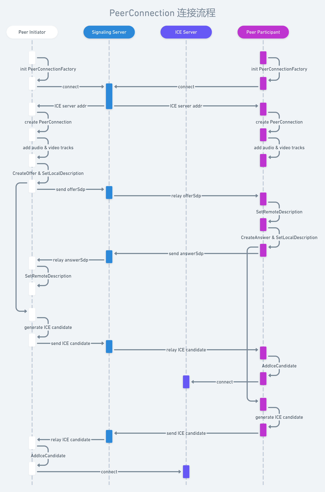
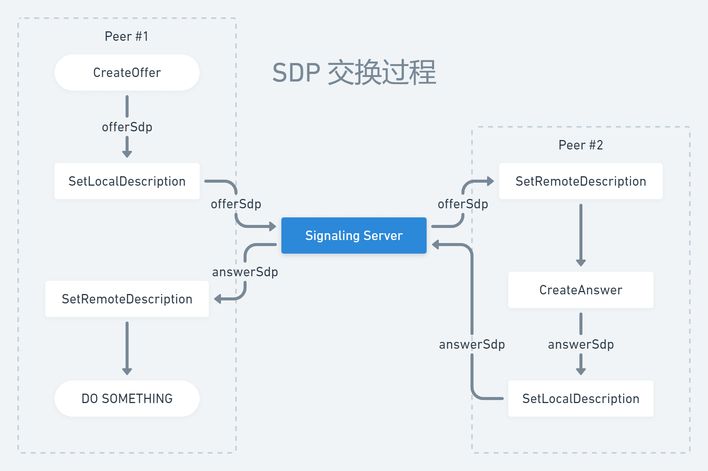
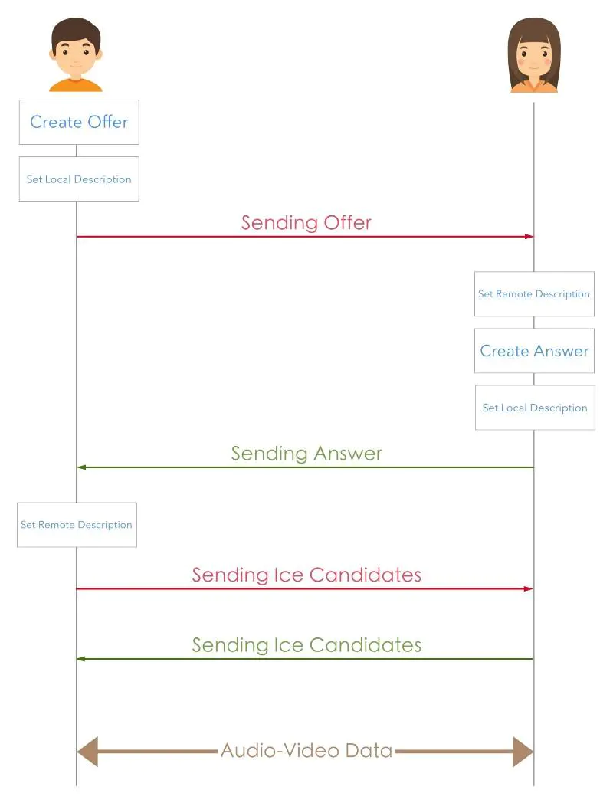

# RTC安卓SDK接入文档

## 需求说明

1. 基于libwebrtc安卓端SDK，实现移动端音视频通话Demo应用。
2. 优先实现一对一的音频方案验证。
3. 实现语音通话功能，包括：选择服务器地址，发起通话，接受通话，结束退出通话。
4. 显示链接日志信息窗口，包括：链接流程的日志，收到的sdp报文信息，ICE Candidate信息，用于联调和验证问题。

## SDK导入方法

1. Android Studio 引入AAR的方法：

Gradle 7.0+ 设置aar路径，将libwebrtc.aar放在app/libs下，dependencies 增加：

```gradle
方式一
    implementation files('libs/libwebrtc.aar')

方式二
    implementation fileTree(dir: 'libs', include: ['*.jar', '*.aar'])

```

2. Gradle 7.0之前的旧版本设置aar路径：

```gradle
方式一
    repositories {
        flatDir {
            dirs 'libs'
        }
    }
    implementation fileTree(dir: 'libs', include: ['*.jar'])

    implementation(name: 'libwebrtc', ext: 'aar')

方式二

    implementation fileTree(dir: 'libs', include: ['*.jar', '*.aar'])
```

3. 若想引用webrtc官方的最新版本库时（需要翻墙），可以使用以下方式：

在项目 settings.gradle 中增加 jcenter 和 google 的仓库

```gradle
pluginManagement {
    repositories {
        gradlePluginPortal()
        google()
        mavenCentral()
        jcenter()
    }
}
dependencyResolutionManagement {
    repositoriesMode.set(RepositoriesMode.FAIL_ON_PROJECT_REPOS)
    repositories {
        google()
        mavenCentral()
        jcenter()
    }
}

在build.gradle(:app)中的 dependencies 中添加：

dependencies {
    implementation 'org.webrtc:google-webrtc:1.0.+'
}

sync后在 External Libraries查看时，当前版本应为1.0.32006

```

4. 需要权限申请开放，在安卓6.0以上，至少需要权限：

CAMERA、RECORD_AUDIO、WRITE_EXTERNAL_STORAGE等

## RTC系统服务端拓扑介绍

简要介绍必须了解的背景知识和名词解释，方便后面进行说明SDK API使用。

Signaling: 信令协议，表示描述媒体或网络的字符串，一般指实现为SDP交换协议

SDP(Session Description Protocol): 会话描述协议, 主要描述媒体信息，发送方的叫Offer, 接受方的叫Answer, 除了名字区分外没有区别，协议内容是一些文本描述本地的音视频编码和网络地址等。客户端需要SDP来描述自己和了解其他客户端。

Signaling Server 信令服务器，为客户端之间互相交换信令进行转发服务的功能

ICE(Interactive Connectivity Establishment): 交互式连接建立，一套协议和交互定义，符合要求的ICE服务器可以用于内网穿透的链接建立。ICE整合了STUN和TURN协议，可以不用了解底层细节。

ICE Server ：实现ICE功能的服务器

SFU Server ：实现媒体协议服务功能的服务器，通常SFU可以兼具ICE的功能（客户端开发时可以认为我们的情况下SFU和ICE逻辑上在一起）

客户端需要跟上述几种服务进行交互，最终建立实时的音视频通道。

## SDK中关键类功能说明

介绍Webrtc一些关键类，下面的例子供参考，具体调用根据需要编写。

#### 1. PeerConnectionFactory

webrtc核心类，用于创建其他类如关键的PeerConnection等

```java
PeerConnectionFactory.initialize(
        PeerConnectionFactory.InitializationOptions.builder(
                getApplicationContext()).createInitializationOptions());

PeerConnectionFactory factory = PeerConnectionFactory.builder().createPeerConnectionFactory();
```

#### 2. VideoCapturer
视频捕捉器的高层抽象接口，它的的子接口为CameraVideoCapturer，封装了安卓相机的使用方法，可以用于获取设备相机数据，切换摄像头，获取摄像头数量等。该对象的创建如下。

下面是一个轮询捕获摄像头的方法例子供参考

```java
    private CameraVideoCapturer createVideoCapture(Context context) {
        CameraEnumerator enumerator;
        if (Camera2Enumerator.isSupported(context)) {
            enumerator = new Camera2Enumerator(context);
        } else {
            enumerator = new Camera1Enumerator(true);
        }

        final String[] deviceNames = enumerator.getDeviceNames();

        for (String deviceName : deviceNames) {
            if (enumerator.isFrontFacing(deviceName)) {
                CameraVideoCapturer videoCapturer = enumerator.createCapturer(deviceName, null);

                if (videoCapturer != null) {
                    return videoCapturer;
                }
            }
        }

        return null;
    }
```

#### 3. VideoSource/VideoTrack
VideoSource为视频源，通过核心类PeerConnectionFactory创建，VideoTrack是对VideoSource的包装，可以方便的将视频源在本地进行播放，添加到MediaStream中进行网络传输。

```java
    CameraVideoCapturer mVideoCapturer = createVideoCapture(this);
    VideoSource videoSource = mPeerConnectionFactory.createVideoSource(mVideoCapturer);
    VideoTrack mVideoTrack = mPeerConnectionFactory.createVideoTrack("videtrack", videoSource);

```

#### 4. AudioSource/AudioTrack
AudioSource/AudioTrack和上面的VideoSource/VideoTrack类似，是对音频的获取和处理了，用PeerConnectionFactory创建。

```java
AudioSource audioSource = mPeerConnectionFactory.createAudioSource(new MediaConstraints());
AudioTrack mAudioTrack = mPeerConnectionFactory.createAudioTrack("audiotrack", audioSource);
```

AudioSource 创建的时候需要传入MediaConstraints这个对象的实例，其用于对媒体的一些约束限制，创建的时候可以直接使用默认的。也可以用下列建议参数，完整的参数列表见Constraints官方文档

```java
MediaConstraints audioConstraints = new MediaConstraints();
//回声消除
audioConstraints.mandatory.add(new MediaConstraints.KeyValuePair("googEchoCancellation", "true"));
//自动增益 
audioConstraints.mandatory.add(new MediaConstraints.KeyValuePair("googAutoGainControl", "true"));
//高音过滤 
audioConstraints.mandatory.add(new MediaConstraints.KeyValuePair("googHighpassFilter", "true"));
//噪音处理
audioConstraints.mandatory.add(new MediaConstraints.KeyValuePair("googNoiseSuppression", "true"));
```

#### 5. MediaStream
音视频的媒体流，通过PeerConnectionFactory创建，用于PeerConnection通过网络传输发送给另一方。在媒体流传输之前，需要将前面获取的VideoTrack和AudioTrack添加进去。

```java
MediaStream mMediaStream = mPeerConnectionFactory.createLocalMediaStream("localstream");
mMediaStream.addTrack(mVideoTrack);
mMediaStream.addTrack(mAudioTrack);
```

#### 6. PeerConnection (重要)
用于p2p网络传输，双方信令的交换。在双方通信之前需要服务器帮助传递信令，并且需要添加STUN和TURN服务器网络穿透。在双方通道打开之后就可以将媒体流发送给另一方。下面是PeerConnection的创建，并将媒体流添加到其中用于网络传输。

```java
PeerConnection peerConnection = mPeerConnectionFactory.createPeerConnection(iceServers, pcConstraints, this);
peerConnection.addStream(mMediaStream);
```

iceServers是连接到外网和网络穿透用的，可以添加STUN和TURN服务器（地址作为字符串列表传参数即可）。

constraints是一个MediaConstrains的实例。可以包含offerToRecieveAudio和offerToRecieveVideo。

```java
  MediaConstraints constraints = new MediaConstraints();
  constraints.optional.add(new MediaConstraints.KeyValuePair("offerToReceiveAudio", "true"));
  constraints.optional.add(new MediaConstraints.KeyValuePair("offerToReceiveVideo", "false"));
```

observer是一个PeerConnectionObserver的实例，对PeerConnection的一些连接状态的监听。

## 客户端时序



上图是主要关键性 API 的调用流程，不是完全的流程，编程需参考 WebRTC 的文档。这里对时序图中的一些情况做具体说明：

先进入房间的用户是发起方（Indicator），后进入房间的用户是参与者（Participant）。本次Demo App可以先不用考虑多房间，只演示单个房间的情况。

add audio & video tracks 不是连接流程中的关键步骤，也可以在 ICE 流程之后再执行。
在 SetLocalDescription 执行成功后，协商 SDP 和 ICE candidate 的流程便会同时开始。

通话双方均与选定的 ICE 服务器连接成功后，即可开始相互推流。在本次实现中 SFU 服务器同时充当 ICE 服务器的角色。

## SDP交换逻辑

WebRTC 使用 PeerConnection 这个类创建连接，它包含两个生成 SDP 的方法，分别是 CreateOffer() 和 CreateAnswer()，CreateOffer()由会话发起方调用生成 offerSdp 并发送到信令服务器；CreateAnswer()在应答方在收到信令服务器消息后被调用生成 answerSdp，然后也发送回信令服务器。

PeerConnection 还包含两个设置 SDP 的方法，分别是 SetLocalDescription() 和 SetRemoteDescription()，前者用来设置本地（自己）的 localSdp，后者用来设置接收到的对端 remoteSdp。对于会话发起方而言，localSdp 是 offerSdp，remoteSdp 是 answerSdp；对于应答方而言，localSdp 是 answerSdp，而 remoteSdp 是接收到的 offerSdp。

上述四个方法的有序组合即可构成 WebRTC 设备之间的 SDP 交换过程。其实这也是一种协商过程，因为应答方需要根据发起方提供的 SDP（ICE 服务器信息、音视频编码信息等）决定如何回复。因为与后续的「连接流程」章节的内容有重合，这里只是简单地给出示意图：



可见附带的WebrtcDemo.zip

## 流程实现示例

#### 视频流相机显示：

1. 创建并初始化 PeerConnectionFactory
2. 创建一个使用设备摄像头的 VideoCapturer 实例
3. 从 Capturer 创建一个 VideoSource
4. 从源创建 VideoTrack
5. 初始化视频控件SurfaceViewRenderer
6. 使用 SurfaceViewRenderer 视图创建视频渲染器并将其添加到 VideoTrack 实例

代码示例

添加SurfaceViewRenderer

```xml
<?xml version="1.0" encoding="utf-8"?>
<android.support.constraint.ConstraintLayout xmlns:android="http://schemas.android.com/apk/res/android"
    xmlns:app="http://schemas.android.com/apk/res-auto"
    xmlns:tools="http://schemas.android.com/tools"
    android:layout_width="match_parent"
    android:layout_height="match_parent"
    tools:context="cc.rome753.wat.MainActivity">

    <org.webrtc.SurfaceViewRenderer
        android:id="@+id/localView"
        android:layout_width="match_parent"
        android:layout_height="match_parent"
        app:layout_constraintBottom_toBottomOf="parent"
        app:layout_constraintLeft_toLeftOf="parent"
        app:layout_constraintRight_toRightOf="parent"
        app:layout_constraintTop_toTopOf="parent" />

</android.support.constraint.ConstraintLayout>
```

```java
public class MainActivity extends AppCompatActivity {

    @Override
    protected void onCreate(Bundle savedInstanceState) {
        super.onCreate(savedInstanceState);
        setContentView(R.layout.activity_main);

        // create PeerConnectionFactory
        PeerConnectionFactory.InitializationOptions initializationOptions =
                PeerConnectionFactory.InitializationOptions.builder(this).createInitializationOptions();
        PeerConnectionFactory.initialize(initializationOptions);
        PeerConnectionFactory peerConnectionFactory = PeerConnectionFactory.builder().createPeerConnectionFactory();

        // create AudioSource
        AudioSource audioSource = peerConnectionFactory.createAudioSource(new MediaConstraints());
        AudioTrack audioTrack = peerConnectionFactory.createAudioTrack("101", audioSource);

        EglBase.Context eglBaseContext = EglBase.create().getEglBaseContext();

        SurfaceTextureHelper surfaceTextureHelper = SurfaceTextureHelper.create("CaptureThread", eglBaseContext);
        // create VideoCapturer
        VideoCapturer videoCapturer = createCameraCapturer();
        VideoSource videoSource = peerConnectionFactory.createVideoSource(videoCapturer.isScreencast());
        videoCapturer.initialize(surfaceTextureHelper, getApplicationContext(), videoSource.getCapturerObserver());
        videoCapturer.startCapture(480, 640, 30);

        SurfaceViewRenderer localView = findViewById(R.id.localView);
        localView.setMirror(true);
        localView.init(eglBaseContext, null);

        // create VideoTrack
        VideoTrack videoTrack = peerConnectionFactory.createVideoTrack("101", videoSource);
        // display in localView
        videoTrack.addSink(localView);
    }

    private VideoCapturer createCameraCapturer(boolean isFront) {
            Camera1Enumerator enumerator = new Camera1Enumerator(false);
            final String[] deviceNames = enumerator.getDeviceNames();

            // First, try to find front facing camera
            for (String deviceName : deviceNames) {
                if (isFront ? enumerator.isFrontFacing(deviceName) : enumerator.isBackFacing(deviceName)) {
                    VideoCapturer videoCapturer = enumerator.createCapturer(deviceName, null);

                    if (videoCapturer != null) {
                        return videoCapturer;
                    }
                }
            }

            return null;
        }

}
```

#### PeerConnection 建立

PeerConnection也就是Peer-to-Peer connection(P2P), 就是两个"人"的连接. 双方分别创建PeerConnection对象, 然后向对方发送自己的网络状况ICE和多媒体编码格式SDP(因为这时候连接还没建立, 所以发送内容是通过服务器完成的). 当双方网络和编码格式协商好后, 连接就建立好了, 这时从PeerConnection中能获取到对方的MediaStream数据流, 也就能播放对方的音视频了。

A(local)和B(remote)代表两个人, 初始化PeerConnectionFactory并分别创建PeerConnection , 并向PeerConnection 添加本地媒体流。

1. A创建Offer
2. A保存Offer(set local description)
3. A发送Offer给B
4. B保存Offer(set remote description)
5. B创建Answer
6. B保存Answer(set local description)
7. B发送Answer给A
8. A保存Answer(set remote description)
9. A发送Ice Candidates给B
10. B发送Ice Candidates给A
11. A,B收到对方的媒体流并播放



如上图所示，虽然步骤多，其实并不复杂，双方基本是对称的。

下面的例子是通过本地回环进行测试的例子，使用到同一个手机的前后摄像头, 把它们当做两个客户端, 建立模拟连接, 发送媒体数据。 这跟实际WebRTC工作流程接近, 建立连接的两人一个是拨打方, 另一个是接受方. 拨打方创建Offer发给接受方, 接收方收到后回复Answer。

```java
public class MainActivity extends AppCompatActivity {

    PeerConnectionFactory peerConnectionFactory;
    PeerConnection peerConnectionLocal;
    PeerConnection peerConnectionRemote;
    SurfaceViewRenderer localView;
    SurfaceViewRenderer remoteView;
    MediaStream mediaStreamLocal;
    MediaStream mediaStreamRemote;

    @Override
    protected void onCreate(Bundle savedInstanceState) {
        super.onCreate(savedInstanceState);
        setContentView(R.layout.activity_main);
        EglBase.Context eglBaseContext = EglBase.create().getEglBaseContext();

        // create PeerConnectionFactory
        PeerConnectionFactory.initialize(PeerConnectionFactory.InitializationOptions
                .builder(this)
                .createInitializationOptions());
        PeerConnectionFactory.Options options = new PeerConnectionFactory.Options();
        DefaultVideoEncoderFactory defaultVideoEncoderFactory =
                new DefaultVideoEncoderFactory(eglBaseContext, true, true);
        DefaultVideoDecoderFactory defaultVideoDecoderFactory =
                new DefaultVideoDecoderFactory(eglBaseContext);
        peerConnectionFactory = PeerConnectionFactory.builder()
                .setOptions(options)
                .setVideoEncoderFactory(defaultVideoEncoderFactory)
                .setVideoDecoderFactory(defaultVideoDecoderFactory)
                .createPeerConnectionFactory();

        SurfaceTextureHelper surfaceTextureHelper = SurfaceTextureHelper.create("CaptureThread", eglBaseContext);
        // create VideoCapturer
        VideoCapturer videoCapturer = createCameraCapturer(true);
        VideoSource videoSource = peerConnectionFactory.createVideoSource(videoCapturer.isScreencast());
        videoCapturer.initialize(surfaceTextureHelper, getApplicationContext(), videoSource.getCapturerObserver());
        videoCapturer.startCapture(480, 640, 30);

        localView = findViewById(R.id.localView);
        localView.setMirror(true);
        localView.init(eglBaseContext, null);

        // create VideoTrack
        VideoTrack videoTrack = peerConnectionFactory.createVideoTrack("100", videoSource);
//        // display in localView
//        videoTrack.addSink(localView);


        SurfaceTextureHelper remoteSurfaceTextureHelper = SurfaceTextureHelper.create("RemoteCaptureThread", eglBaseContext);
        // create VideoCapturer
        VideoCapturer remoteVideoCapturer = createCameraCapturer(false);
        VideoSource remoteVideoSource = peerConnectionFactory.createVideoSource(remoteVideoCapturer.isScreencast());
        remoteVideoCapturer.initialize(remoteSurfaceTextureHelper, getApplicationContext(), remoteVideoSource.getCapturerObserver());
        remoteVideoCapturer.startCapture(480, 640, 30);

        remoteView = findViewById(R.id.remoteView);
        remoteView.setMirror(false);
        remoteView.init(eglBaseContext, null);

        // create VideoTrack
        VideoTrack remoteVideoTrack = peerConnectionFactory.createVideoTrack("102", remoteVideoSource);
//        // display in remoteView
//        remoteVideoTrack.addSink(remoteView);


        mediaStreamLocal = peerConnectionFactory.createLocalMediaStream("mediaStreamLocal");
        mediaStreamLocal.addTrack(videoTrack);

        mediaStreamRemote = peerConnectionFactory.createLocalMediaStream("mediaStreamRemote");
        mediaStreamRemote.addTrack(remoteVideoTrack);

        call(mediaStreamLocal, mediaStreamRemote);
    }

        private void call(MediaStream localMediaStream, MediaStream remoteMediaStream) {
        List<PeerConnection.IceServer> iceServers = new ArrayList<>();
        peerConnectionLocal = peerConnectionFactory.createPeerConnection(iceServers, new PeerConnectionAdapter("localconnection") {
            @Override
            public void onIceCandidate(IceCandidate iceCandidate) {
                super.onIceCandidate(iceCandidate);
                peerConnectionRemote.addIceCandidate(iceCandidate);
            }

            @Override
            public void onAddStream(MediaStream mediaStream) {
                super.onAddStream(mediaStream);
                VideoTrack remoteVideoTrack = mediaStream.videoTracks.get(0);
                runOnUiThread(() -> {
                    remoteVideoTrack.addSink(localView);
                });
            }
        });

        peerConnectionRemote = peerConnectionFactory.createPeerConnection(iceServers, new PeerConnectionAdapter("remoteconnection") {
            @Override
            public void onIceCandidate(IceCandidate iceCandidate) {
                super.onIceCandidate(iceCandidate);
                peerConnectionLocal.addIceCandidate(iceCandidate);
            }

            @Override
            public void onAddStream(MediaStream mediaStream) {
                super.onAddStream(mediaStream);
                VideoTrack localVideoTrack = mediaStream.videoTracks.get(0);
                runOnUiThread(() -> {
                    localVideoTrack.addSink(remoteView);
                });
            }
        });

        peerConnectionLocal.addStream(localMediaStream);
        peerConnectionLocal.createOffer(new SdpAdapter("local offer sdp") {
            @Override
            public void onCreateSuccess(SessionDescription sessionDescription) {
                super.onCreateSuccess(sessionDescription);
                // todo crashed here
                peerConnectionLocal.setLocalDescription(new SdpAdapter("local set local"), sessionDescription);
                peerConnectionRemote.addStream(remoteMediaStream);
                peerConnectionRemote.setRemoteDescription(new SdpAdapter("remote set remote"), sessionDescription);
                peerConnectionRemote.createAnswer(new SdpAdapter("remote answer sdp") {
                    @Override
                    public void onCreateSuccess(SessionDescription sdp) {
                        super.onCreateSuccess(sdp);
                        peerConnectionRemote.setLocalDescription(new SdpAdapter("remote set local"), sdp);
                        peerConnectionLocal.setRemoteDescription(new SdpAdapter("local set remote"), sdp);
                    }
                }, new MediaConstraints());
            }
        }, new MediaConstraints());
    }
}
```

注意: 即使没有真正使用到网络, 但是要添加网络权限
```xml
<uses-permission android:name="android.permission.INTERNET"/>
<uses-permission android:name="android.permission.ACCESS_NETWORK_STATE"/>
```

#### 信令交换

上面的例子使用本地网络进行回环测试，这里的数据传输是内存共享, 而实际是通过网络发送SDP进行媒体描述交换。

实际测试中，信令服务器是一个使用WebSocket进行通信的http服务，协议体内容为简单的json，接口描述如下：

POST /rtc/v1/play/ application/json
{
    'type': 'answer', 
    'sdp': 'session.sdp'
}


## 参考资料

W3C WebRTC 1.0
https://www.w3.org/TR/webrtc/
https://webrtc.org/getting-started/overview
https://w3c.github.io/webrtc-stats/