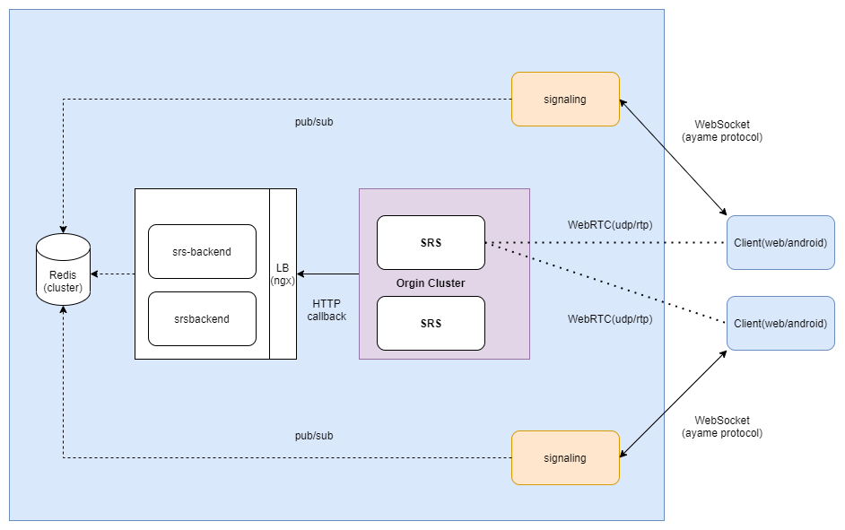

# 基于SRS和webrtc构建音频通话解决方案

## 默认demo架构存在的问题

1. 整个体系中存在多个单点，只可以用作poc，无法实际生产可用。
   
2. httpx-static作为代理，是为了解决跨域和https转换的问题，但是实际部署中，我们的架构应该会放在统一的负载均衡器后方，这个组件不必要。

3. SRS需要采取源站集群方案来实现HA

4. 原信令服务器，在进程内存中通过共享状态进行信令交换，无法支持横向扩展，无法支持错误恢复。

5. SRS服务的回调接口没有处理，无法结构化获取媒体服务器的任何状态，无法进行进一步控制

## 改造方案描述

1. 信令服务改造，根据1对1音频通信的场景，缓存信令对应关系在redis缓存中，实现无状态错误恢复，支持横向扩展。加入服务本身的WSS支持，可以不依赖前端代理工作。

2. srs回调协议后端实现，收取srs http callback api中描述的rest接口，实现对srs集群的统一控制，支持动态配置srs参数，方便后续升级改造。

3. 配置srs为多节点源站集群模式，支持HA，支持配置多个源站，支持配置多个源站的负载均衡策略。

## 工作内容预估

1. 调研当前信令服务代码，整理协议方案，设计信令服务架构，设计信令服务接口，信令服务实现。

2. 调研srs集群配置方案，验证集群负载均衡能力

3. 调研srs回调http接口，设计回调服务器架构方案
